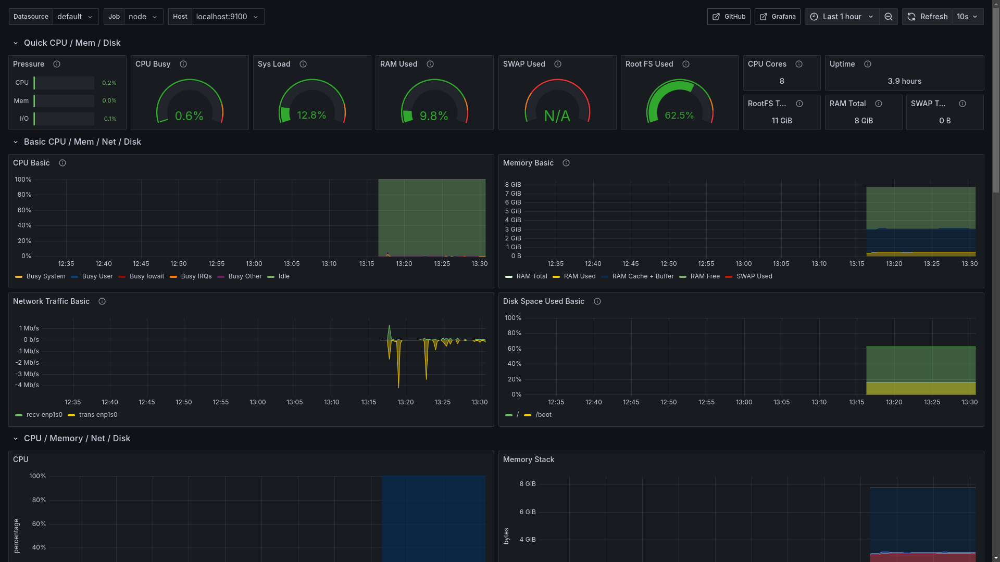

# Hexagone Ubuntu Server

## Machine

- [Ubuntu Serveur](https://ubuntu.com/download/server) 24.04
- Sous KVM et virt-manager
- Réseau virtuel NAT (configuration par défaut)
- Hostname: ubuntu-group-4
- Utilisateur admin: "util"
- Configuration
    - 8 vCPU
    - 8Gb de RAM
    - 25Gb de disque 

## Configuration Initiale

On active le Firewall en laissant passer les connections SSH:

```shell
sudo ufw allow ssh
sudo ufw enable
```

On trouve l'IP de la VM depuis l'interface de virt-manager et on peut ensuite se connecter en SSH depuis la machine hôte:

```shell
ssh -o IdentitiesOnly=yes util@XXX.XXX.XXX.XXX
```

## Services

### Samba

Installer samba et ouvrir le firewall:

```shell
sudo apt install -y samba
sudo ufw allow samba
```

Configurer le dossier de stockage:

```shell
mkdir /home/util/samba
sudo nano /etc/samba/smb.conf
```

Et on ajoute une configuration qui pointe vers le répertoire de stockage:

```
[ubuntu-server]
    comment = Samba on Ubuntu Server
    path = /home/util/samba
    read only = no
    browsable = yes
```

On peut créer des fichiers de test:

```shell
for i in {1..10}; do
  touch /home/util/samba/test_${i}.js
done
```

Donner un mot de passe à l'utilisateur util pour l'accès samba:

```shell
sudo smbpasswd -a util
```

Redémarrer samba pour appliquer la configuration:

```shell
sudo systemctl restart smbd
```

### Prometheus / Grafana

```shell
sudo apt install -y prometheus
```

On déploie le fichier [`/etc/prometheus/prometheus.yml`](./prometheus.yml).

La différence avec le fichier de configuration par défaut est celle là:

On expose uniquement Prometheus et l'exporteur de métriques système sur la machine locale.

```shell
echo "ARGS=\"--web.listen-address=127.0.0.1:9090\"" | sudo tee /etc/default/prometheus
echo "ARGS=\"--web.listen-address=127.0.0.1:9100\"" | sudo tee /etc/default/prometheus-node-exporter
```

On redémare ensuite les deux services:

```shell
sudo systemctl restart prometheus
sudo systemctl restart prometheus-node-exporter
```

On installe Grafana Entreprise:

```shell
wget https://dl.grafana.com/enterprise/release/grafana-enterprise_11.4.0_amd64.deb
sudo apt install ./grafana-enterprise_11.4.0_amd64.deb
```

On déploie le fichier [`/etc/grafana/grafana.ini`](./grafana.ini).

Il expose Grafana sur la machine local mais configure le subpath pour l'URL publique.

```shell
sudo systemctl restart grafana
```

### Serveur Web (Caddy avec HTTPS)

On installe et on démare Caddy:

```shell
sudo apt install -y debian-keyring debian-archive-keyring apt-transport-https curl
curl -1sLf 'https://dl.cloudsmith.io/public/caddy/stable/gpg.key' | sudo gpg --dearmor -o /usr/share/keyrings/caddy-stable-archive-keyring.gpg
curl -1sLf 'https://dl.cloudsmith.io/public/caddy/stable/debian.deb.txt' | sudo tee /etc/apt/sources.list.d/caddy-stable.list
sudo apt update
sudo apt install -y caddy
sudo systemctl enable caddy
```

On configure le firewall:

```shell
sudo ufw allow proto tcp from any to any port 80,443
sudo ufw allow proto udp from any to any port 80,443
```

On ouvre sur TCP mais aussi sur UDP pour profiter du support de HTTP/3 de Caddy.

```shell
sudo mkdir /var/www
```

On crée le fichier principal du serveur [`/var/www/index.html`](./index.html).

On déploie ensuite le fichier [`/etc/caddy/Caddyfile`](./Caddyfile)

Ce fichier active le support de HTTP/1.1, HTTP/2 et HTTP/3 et le HTTPS avec un certificat auto-généré.

Le subpath `/grafana` est configuré en temps que reverse proxy vers l'addresse de Grafana sur la machine locale tandis que le reste des chemins sert les fichiers dans `/var/www`

On redémare Caddy et on ajoute son autorité de certification à la machine.

```shell
sudo systemctl restart caddy
caddy trust
```

## Tests

On commence par configurer la résolution de nom et l'autorité de certification sur la machine hôte:


Sur la VM:
```shell
# On doit passer par une copie intermédiaire car scp ne permet pas de récupérer des fichier accessible seulement par les administrateurs
sudo cp /var/lib/caddy/.local/share/caddy/pki/authorities/local/root.crt ~/root.crt
```

Sur la machine hôte:
```shell
scp -o IdentitiesOnly=yes util@XXX.XXX.XXX.XXX:root.crt root.crt
sudo trust anchor root.crt
```

L'autorité de certification peut devoir être ajoutée également aux navigateurs utilisés.

On ajoute la résolution de nom à la machine hôte:

```shell
sudo nano /etc/hosts
```

```
XXX.XXX.XXX.XXX ubuntu-group-4
```

### Samba

On peut se connecter depuis l'hôte avec un client Samba (ici Nautilus):

```shell
# util + mot de passe définit plus tôt
smb://ubuntu-group-4/ubuntu-server
```


### Grafana

On peut accéder au dashboard Grafana sur https://ubuntu-group-4/grafana et se connecter avec `admin`/`admin` (on doit changer de mot de passe à la première connection).

On ajoute une source de donnée de type Prometheus avec l'url `http://127.0.0.1:9090`.

On peut ensuite importer un dashboard tout fait pour node_exporter comme [celui-là](https://grafana.com/grafana/dashboards/1860-node-exporter-full).



### Serveur Web

On peut vérifier le contenu de la page https://ubuntu-group-4.

Pour tester le HTTP/3 il faut sois une version de développement de curl sois un autre client compatible.

Pour le client de Cloudflare:

```shell
git clone --recursive https://github.com/cloudflare/quiche
cargo run --bin quiche-client -- https://ubuntu-group-4
```


### Sécurité

On peut vérifier si les ports ouverts à l'extérieur sont bien ceux qu'on veut avec `sudo netstat -ntlp`


Seul Samba, Caddy et SSH devraient être ouvert avec `:::` (ipv6) ou `0.0.0.0` (ipv4).

Prometheus, node exporter ne devrais pas être accessible depuis la machine hôte avec `<ip ou nom de domaine>:<port>`.